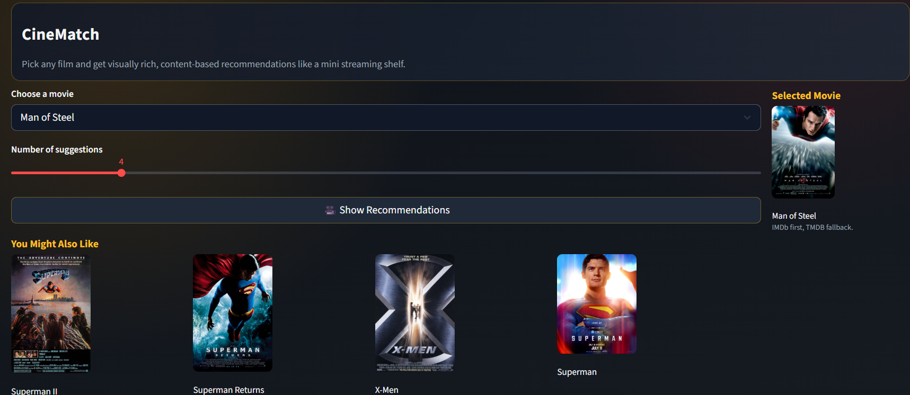

# Movie Recommendation System



This project recommends movies based on content similarity (what the movie is about), then shows posters in a clean Streamlit UI.


## Project Files

- app.py: Main app code (UI + recommendation logic + poster fetching).
- movies.pkl: Preprocessed movie dataset used by the app.
- requirements.txt: Python packages needed to run the app.
- Movie_recommendation_System.ipynb: Notebook used during data preparation/training experiments.


## How Posters Are Fetched

The app tries poster sources in this order:

1. IMDb suggestion API (no API key needed).
2. TMDB API (only if `TMDB_API_KEY` environment variable is set).
3. Placeholder image (only if both APIs fail for a title).

So most titles should show real posters automatically.

## How Similarity Is Calculated 

The app combines three signals:

1. Content similarity (55%)
: Uses TF-IDF + cosine similarity on movie text (`cleaned_text` or `combined`).

2. Genre similarity (35%)
: Detects known genres from the text (like `thriller`, `mystery`, `action`) and compares genre overlap.

3. Title similarity (10%, gated)
: Small bonus for franchise/name closeness, but only when there is already meaningful content or genre match.

Final score idea:

```text
score = 0.55 * content + 0.35 * genre + 0.10 * title_bonus
```

This helps keep recommendations more genre-aware (for example thriller/mystery movies returning similar styles).

## Full App Flow

1. Load movie data from `movies.pkl` (or `movie_dict.pkl` if present).
2. Build text features (TF-IDF vectors).
3. Build title features (character n-grams).
4. Infer genres from text and create genre vectors.
5. When you click Show Recommendations:
	 - Find selected movie index.
	 - Compute blended similarity score against all movies.
	 - Sort descending and take top K results.
6. Fetch posters for those titles and display cards.
